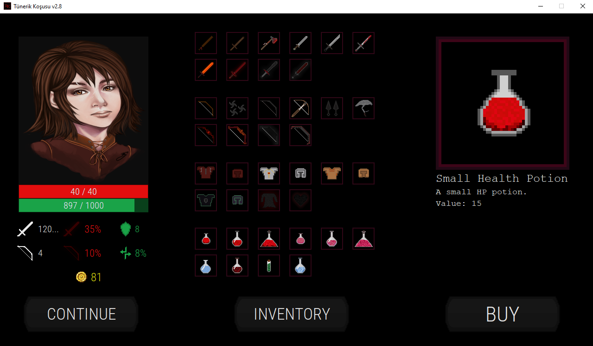

# Tünerik Koşusu
<strong>Tünerik Koşusu</strong> is a GUI based (java swing) dungeon crawler game where you try to find some meaning as to why you're there in the first place...  

This game was my first programming project I've ever made in my life.  
This project had some seriously bad code in it, and to be frankly honest it still does...  
This project really helped me grow as a programmer by helping me compare myself to my old self.  
I tried cleaning up the code as much as I could but it's still a little messy.  

You can play this game by downloading the JAR from the releases section if you want.  
The game still has few bugs but it's playable-ish...  

Whole project was coded by only me (Oğuzhan Topaloğlu)  
My friend (Yunus Emre Çay) helped me with few SFX's and most of the graphics so special thanks to him.  

This project uses my java swing extension: <a href="https://github.com/oziris78/better-swing">better-swing</a>

 

# Images

 

 

 

 

 

 

 

 

